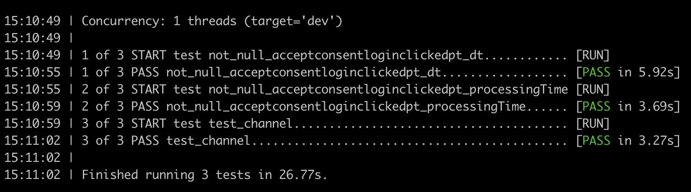

# Files to consider:
 - models/<model_name>
   - Contains a collection of sql files, each one of them is a table/view that will be created
   - Also contains description and definition about sources and sinks with contraints sink tables must match. Tests will check this constraints and fail if wrong
 - profiles.yml
   - Contains connections which dbt must connect to. Named as local, dev (default) and dev-redshift
 - dbt_project.yml
   - Contains a list os models (collection of sqls), each one of them with its configuration (materialization, partition, file format etc...)
  - This configuration can be overriden inside the specific sql file in each model

# Common steps to run from a local computer

## Create and activate virtual env
```bash
pip3 install virtualenv

virtualenv --python python3.9 virtual

source virtual/bin/activate
```

## Install dependencies

```
pip install -r requirements.txt
```

## Create environment vars
- profiles.yml is located in the project folder, in order to dbt to be able to read it, an environment variable must be created as follows:

```bash
export DBT_PROFILES_DIR=$PATHTOFOLDER/dbt-spark-test
```
- As an alternative, profiles.yml can be moved to $HOME/.dbt/profiles.yml as this is the default folder


# Local as sink

## Running docker
> **PREREQUISITE**: Docker must be installed and running 
- Inside dockers folder run:

```bash
 sh build_dockers.sh 
 docker-compose -f dockers/docker-compose.yml up
```

- This will create an Airflow and STS instance with the following connection data (no password required):
  - user: dbt.example
  - host: localhost
  - port: 1000

## testing models
- Every dbt command must be run from the dbt project folder (dbt_datalake_project) and with the virtual environment activated


```
dbt test --target local --models example
```

- Find test files in SQL files in test/example


## Seeding data
```bash
dbt seed --target local
```
- This will create an example table (example.taxi_zone_lookup) from data folder

## Running models 
- There is only one model called example
```bash
dbt run --target local --models example
```
- This will create a table and a view matching with the sql file names
  - Table: example.taxi_zone_incremental
  - View: example.taxi_zone_lookup_view


# Dev as sink

## Running in Dev
- Target can be skipped in the command as dev is defined as the default target
- Vars represent lower and upper limit to read processingTime partitions in source
- dt represents the desired dt to be moved to sink table

```
dbt run --models dt --target dev --vars '{"ptLowerLimit": "2021060100", "ptUpperLimit": "2021070608", "dt": "2021070608"}'
dbt run --models dt --vars '{"ptLowerLimit": "2021060100", "ptUpperLimit": "2021070608", "dt": "2021070608"}'
```

- This will create a table called dbtsink in the schema defined in profiles.yml(ref_hourly_infojobs_events_behaviourpt)

## Testing in Dev
- Tests can be found as sql files in test folder inside the model folder
- Queries in test must return 0 rows to succeed
- A successfull run must be executed first
```
dbt test --models dt --target dev
dbt test --models dt
```




# Resources:
- Learn more about dbt [in the docs](https://docs.getdbt.com/docs/introduction)
- Check out [Discourse](https://discourse.getdbt.com/) for commonly asked questions and answers
- Join the [chat](http://slack.getdbt.com/) on Slack for live discussions and support
- Find [dbt events](https://events.getdbt.com) near you
- Check out [the blog](https://blog.getdbt.com/) for the latest news on dbt's development and best practices